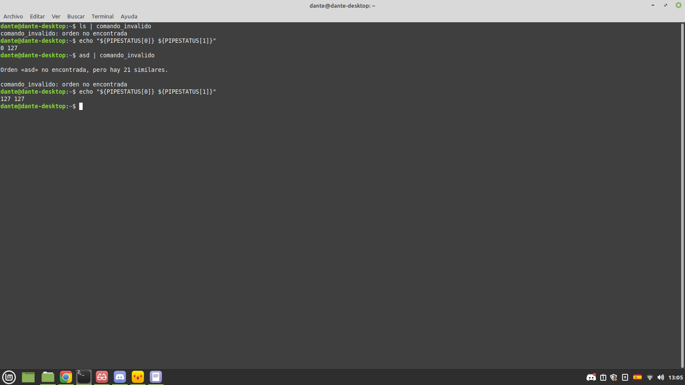

# Lab: shell

### Búsqueda en $PATH

* ¿cuáles son las diferencias entre la syscall execve(2) y la familia de wrappers proporcionados por la librería estándar de C (libc) exec(3)?
    - Tanto la syscall execve, como la familia de wrappers proporcionados por la libreria estandar de c (libc) exec(3) nos permiten modificar la imagen de un proceso, es decir, modificar su memoria virtual, su entorno, sus argumentos y su adress space, pero se conserva sus files descriptors, PID y PPID. La diferencia principal reside en que execve es una llamada al sistema o system call, mientras que la familia de funciones exec son llamados a la libreria o library calls. Una Syscall es una funcion proporcionada por el Kernel, la cual permite pasar de modo usuario a modo kernel y asi poder acceder a los recursos del hardware, ademas esta llamada se ejecuta en modo Kernel. Las Library Calls son funciones proporcionadas por una biblioteca de programacion, estas se ejecutan en modo usuario y no hay cambio de contexto. La familia de wrappers exec(3) son frontends para execve(2).

* ¿Puede la llamada a exec(3) fallar? ¿Cómo se comporta la implementación de la shell en ese caso? 
    - Si la llamada a exec(3) es exitosa no se devuelve ningun valor, en caso de fallar se devuelve -1 y se almacena en la variable errno el codigo asociado al tipo de error que ocurrio. En caso de fallar la shell imprime por el canal de error estandar un mensaje de error y a continuacion el tipo de error ocurrido.
--- 
### Comandos built-in

*  ¿Entre cd y pwd, alguno de los dos se podría implementar sin necesidad de ser built-in? ¿Por qué? ¿Si la respuesta es sí, cuál es el motivo, entonces, de hacerlo como built-in? (para esta última pregunta pensar en los built-in como true y false)
    - El comando pwd, print working directory, muestra por pantalla el directorio donde se encuentra parada la shell, dado que el proceso hijo recibe las variables de entorno de su proceso padre, al realizar un fork y exec, el proceso hijo heredaria el mismo directorio actual que el de la shell, por lo tanto podria implementarse sin necesidad de ser built-in. Sin embargo, es inecesario realizar un fork y un exec para ejecutar este comando, por lo que es mas eficiente implementarlo como built-in.
    - El comando cd modifica el directorio donde se para la shell, si no fuese implementado como un built-in, el proceso hijo seria el que modifique su directorio de trabajo mientras que el proceso padre, en este caso la shell, seguiria manteniendo el mismo directorio. 

---

### Variables de entorno adicionales

* ¿Por qué es necesario hacerlo luego de la llamada a fork(2)?
    - Cuando hacemos una llamada a fork(2), se crea un proceso hijo que es una copia del proceso padre, es decir, el proceso hijo se copia toda la memoria de proceso del proceso padre en su espacio de direcciones de memoria, y en lo unico que difieren es en su PID y PPID. De esta manera, el proceso hijo hereda las variables de entorno de su padre. Si deseamos que las variables de entorno sean temporarias, entonces debemos añadirlas desde el proceso hijo, ya que si lo hiciera el proceso padre, luego todos sus hijos heredarian estas variables de entorno, por lo que dejarian de ser temporarias.

* En algunos de los wrappers de la familia de funciones de exec(3) (las que finalizan con la letra e), se les puede pasar un tercer argumento (o una lista de argumentos dependiendo del caso), con nuevas variables de entorno para la ejecución de ese proceso. Supongamos, entonces, que en vez de utilizar setenv(3) por cada una de las variables, se guardan en un array y se lo coloca en el tercer argumento de una de las funciones de exec(3).
    * ¿El comportamiento resultante es el mismo que en el primer caso? Explicar qué sucede y por qué.
    * Describir brevemente (sin implementar) una posible implementación para que el comportamiento sea el mismo.
    -  Dentro de la familia de funciones exec(3), existen dos: execle y excvpe, a las cuales podemos pasarle por argumento nuevas variables de entorno para su ejecucion, el resto de las funciones conservan el mismo entorno que el proceso que  hizo la llamada a la funcion exec. En este caso el comportamiento resultante no seria el mismo que el del primer caso, dado que si ejecutasemos un execvpe unicamente con las variables de entorno que figuran en el array eargv del struct execcmd, estas serian las unicas variables de entorno que estarian definidas en el nuevo proceso exec, y se perderian el resto de las variables de entorno definidas en el padre como $PATH o $HOME si estas no estuvieran especificadas en el arreglo. Para que la implementacion fuera la misma, deberiamos pasarle por argumento todas las variables de entorno del proceso que llama al exec, es decir, las que figuran en eviron, y ademas las que aparecen en el array eargv del struct. 

---

### Procesos en segundo plano

* Detallar cuál es el mecanismo utilizado para implementar procesos en segundo plano.

    - Para especificar que un proceso se desea correr en segundo plano, se debe agregar el caracter "&" al final de la instruccion que deseamos ejecutar. Esto caracter le indica a la shell que el proceso debe realizarse en segundo plano, por lo que en lugar de hacer un wait bloqueante, se realiza un wait no bloqueante y no se espera que el hijo termine. Esto se logra utilizando la funcion waitpid con el flag WNOHANG, dado que el padre no espera a que termine el hujo, este se convierte en un zombie. 

---

### Flujo estándar

* Investigar el significado de 2>&1, explicar cómo funciona su forma general y mostrar qué sucede con la salida de cat out.txt en el ejemplo. Luego repetirlo invertiendo el orden de las redirecciones. ¿Cambió algo?
    - Para comprender el significado de la expresion 2>&1, vamos a descomponer la expresion en distintos factores:
        - 2: Este numero hace referencia al segundo file despriptor, el cual generalmente esta asociado al error standar o stderr.
        - ">" : Este simbolo nos indica que se llevara a cabo una redireccion, la salida del argumento izquierdo sera la misma que la salida del argumento derecho.
        - &1: Este numero hace referencia al primer file descriptor, generlamente asociado a la salida estandar o stdout. Se usa el simbolo & para denotar que el numero 1 hace alusion a un file descriptor. Si ejecutasemos el comando 2>1, la terminal interpretaria a 1 como un nombre de un archivo y no como un file descriptor.
     - De esta manera 2>&1, nos indica que la salida del file descriptor 2 se haga por el mismo lugar que la salida del file descriptor. Para estudiar el comportamiendo deseado, aplique el comando:
     > ls -C /home /noexiste >out.txt 2>&1
     - Al ver el archivo out.txt, aparecian las siguientes lineas: 
        - ls: no se puede acceder a '/noexiste': No existe el archivo o el directorio.
        - /home: 
        - dante 
     - En primer lugar, la salida de ls /home se redirecciono al archivo out.txt, luego la salida de error de ejecutar ls -C /home /noexiste se redirecciono al mismo lugar que apunta el primer file descriptor, que en lugar de ser la salida estandar, ahora es el archivo out.txt. 
     - Si invierto el orden de las redirecciones, es decir ejecuto: 
     > ls -C /home /noexiste 2>&1 >out.txt
     - Ahora en primer lugar me aparece por pantalla:
        - ls: no se puede acceder a '/noexiste': No existe el archivo o el directorio.
     - Ya que se redirecciona la salida de error a la salida estandar, luego en out.txt aparecen las lineas: 
        - /home: 
        - dante 
     - Dado que la salida estandar ahora se redirecciono al archivo out.txt
---

### Tuberías Simples (pipes)

* Qué ocurre con el exit code reportado por la shell si se ejecuta un pipe ¿Cambia en algo? ¿Qué ocurre si, en un pipe, alguno de los comandos falla? Mostrar evidencia (e.g. salidas de terminal) de este comportamiento usando bash. Comparar con la implementación del este lab.

    - En Bash los exit codes reportados al ejecutar un pipe se almacenan en una variable de entorno llamada PIPESTATUS, en este arreglo podremos econtrar todos los codigos de salida obtenidos al ejecutar el pipe. Si alguno de los comandos falla, se reporta el mensaje correspondiente al error obtenido por pantalla, se almacena su codigo de salida en el arreglo y se procede a ejecutar el siguiente comando.  

Format: 

    - En la imagen podemos observar que en un primer caso el primer comando ls se ejecuta correctamente, pero el segundo comando falla y se imprime el mensaje de que noe xiste dicho comando, los codigos de salida para cada pipe fueron 0 y 127.
    - En el segundo caso, ambos comandos son invalidos, por lo que se imprime el mensaje de error para los dos comandos y sus codigos de salida son 127.
    - La bash implementada no cuenta con una variable de entorno definida que almacene los codigos de salida, por lo que se muestra el exit code de el ultimo comando ejecutado previo al pipe. 
---

### Pseudo-variables

* Investigar al menos otras tres variables mágicas estándar, y describir su propósito. Incluir un ejemplo de su uso en bash (u otra terminal similar).
    - $$: Devuelve el process ID de la shell actual.
    - $-: Muestra la lista de opciones de la shell actual. 
    - $!: Devuelve el process ID del ultimo proceso ejecutado en segundo plano. 
---

