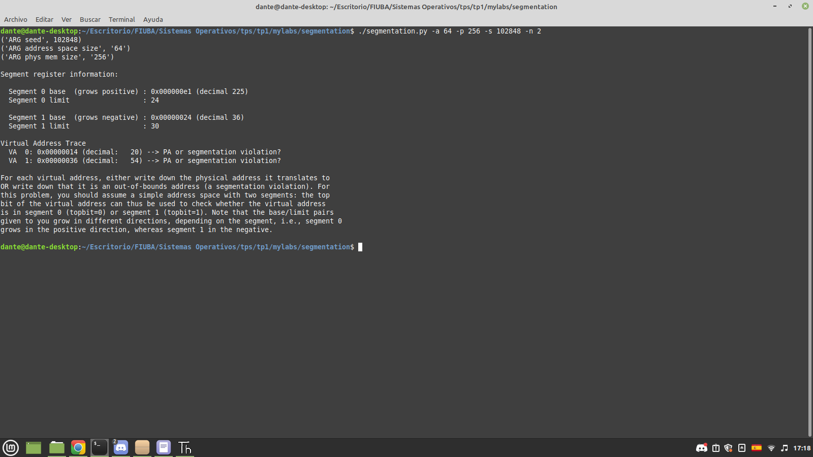
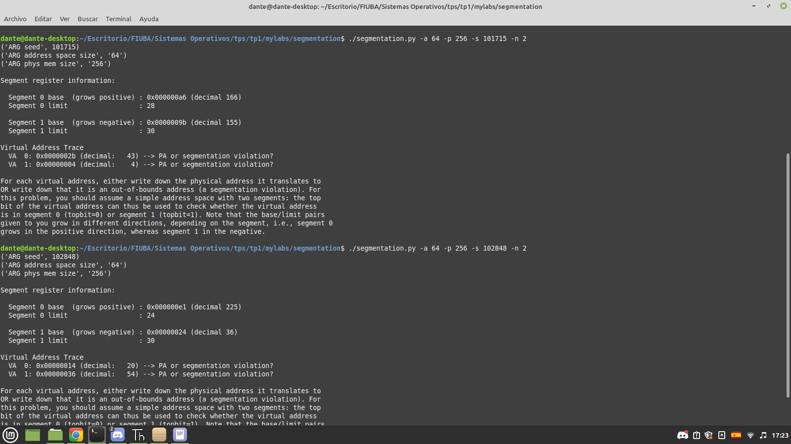
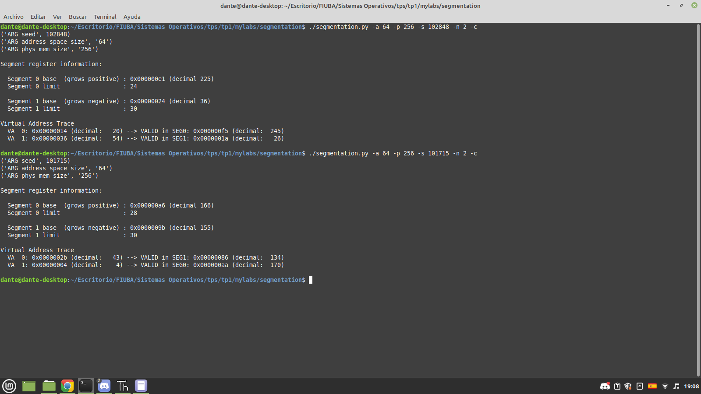
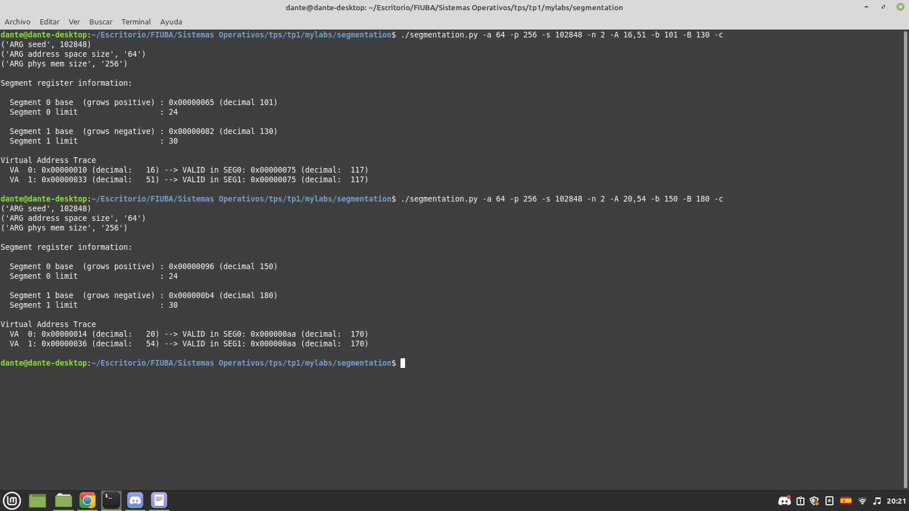

Segmentacion
===========================

Simulacion de Traducciones
--------------

    1)Tomar los dos accesos a memoria y decidir si producen una dirección física o bien generan un segmentation fault

Format:         

Format:         

    Para simplificar los calculos vamos a trabajar con direcciones fisicas en numeros decimales.

    Las traduccion de direccion virtual a fisica se calcula distinta para los diferentes segmentos.
    Para el segmento 0 se calcula: Direccion fisica = Direccion Virtual + Base
    Para el segmento 1 se calcula: Direccion fisica = Base + (Direccion Virtual - Tamaño Adress Space)
    En nuestro caso el adress space es de 64 bytes.

    Para el padron 102848:
    El segmento 0 tiene base = 225 y limite = 24, de esta manera como el segmento 0 crece hacia las direcciones altas, el rango de direcciones fisicas de este segmento va desde 225 hasta 248
    El segmento 1 tiene base = 36 y limite = 30, como el segmento 1 crece hacia las direcciones bajas, el rango de direcciones fisicas de este segmento va desde 6 hasta 35.

    Se obtuvieron las siguientes direcciones virtuales: 20 y 54
    Calculo la direccion fisica de 20 para ambos segmentos:
    Direccion fisica segmento 0 = 20 + 225 = 245
    Direccion fisica segmento 1 = 36 + (20 - 64) = -8 -> direccion invalida

    De esta manera vemos que la direccion virtual 20 es mapeada a la direccion fisica 245, estaria dentro del segmento 0

    Calculo la direccion fisica de 54 para ambos segmentos:
    Direccion fisica segmento 0 = 54 + 225 = 279 -> direccion invalida, el espacio de direcciones fisicas llega hasta 256
    Direccion fisica segmento 1 = 36 + (54 - 64) = 26 

    De esta manera vemos que la direccion virtual 54 es mapeada a la direccion fisica 26, estaria dentro del segmento 1

    Para el padron 101715:
    El segmento 0 tiene base = 166 y limite = 28, de esta manera como el segmento 0 crece hacia las direcciones altas, el rango de direcciones fisicas de este segmento va desde 166 hasta 194
    El segmento 1 tiene base = 155 y limite = 30, como el segmento 1 crece hacia las direcciones bajas, el rango de direcciones fisicas de este segmento va desde 125 hasta 155.

    Se obtuvieron las siguientes direcciones virtuales: 43 y 4

    Calculo la direccion fisica de 43 para ambos segmentos:
    Direccion fisica segmento 0 = 43 + 166 = 209 -> segmentation fault
    Direccion fisica segmento 1 = 155 + (43 - 64) = 134

    De esta manera vemos que la direccion virtual 43 es mapeada a la direccion fisica 134, estaria dentro del segmento 1

    Calculo la direccion fisica de 4 para ambos segmentos:
    Direccion fisica segmento 0 = 4 + 166 = 170 
    Direccion fisica segmento 1 = 155 + (4 - 64) = 95 -> segmentation fault

    De esta manera vemos que la direccion virtual 4 es mapeada a la direccion fisica 170, estaria dentro del segmento 0

    2)Explicar el razonamiento del punto anterior, indicando las cuentas realizadas

    En el punto anterior se explico detalladamente el razonamiento y las cuentas realizadas.

    3)Validar los resultados volviendo a correr con el flag -c

Format:         

...

Traducciones Inversas
----------

1) Para cada corrida modificada, determinar los valores de cada segmento, y especificarlos mediante los cuatro flags: -b, -l, -B y -L. Existe la posibilidad de que no se necesiten todos los valores para lograr el objetivo, o bien que el objetivo no sea posible. Si hay más de una solución; elegir la que tenga los límites de segmentos más pequeños. En caso de que no sea posible; explicar por qué.

// Corrida 102848 original:
 - VA0: 20 --> PA 245
 - VA1: 54 --> PA 26

// Corrida 101715 original:
 - VA0: 43 --> PA 134
 - VA1: 4 --> PA 170

// Corrida 102848 modificada:
  - VA0: 20 --> PA 134
  - VA1: 54 --> PA 170

// Corrida 101715 modificada:
  - VA0: 43 --> PA 245
  - VA1: 4 --> PA 26

Si quiero que la direccion fisica 20 se traduza a la 134:
 - 134 = 20 + base 0 -> base 0 = 114
 -   Si quiero que el caiga dentro del segmento 0, el limite para este segmento debe ser: 134 + 1 - 114 = 21
   
Si quiero que la direccion fisica 54 se traduza a la 134:
 - 170 = 54 + base 1 -64 -> base 1 = 180
 -   Si quiero que la direccion caiga dentro del segmento 1, el limite para este: 180 + 1 - 170 = 11

Para la primer pasada se obtiene: b = 114 l = 21 B = 180 L = 11 

Si quiero que la direccion fisica 43 se traduza a la 245:
 - 245 = 43 + base 1 - 64 -> base 1 = 266
 - Si quiero que la direccion caiga dentro del segmento 1, el limite para este debe ser: 266 + 1 - 245 = 22

Si quiero que la direccion fisica 4 se traduza a la 26:
 - 26 = 4 + base 0 -> base 0 = 22
 - Si quiero que el caiga dentro del segmento 0, el limite para este segmento debe ser: 134 + 1 - 114 = 26 + 1 - 22 = 5

Para la segunda pasada se obtiene: b = 22 l = 5 B = 266 L = 22

2) En caso de que haya solución, mostrar además la corrida de la simulación que cumple con los requisitos.

Format:         

...

Limites de Segmentacion
----------------

Utilizando un espacio de direcciones virtuales de 5-bits; y un espacio de direcciones físicas de 7-bits. Responder:

1) ¿Cuál es el tamaño (en número de direcciones) de cada espacio (físico y virtual)?
    Si se utiliza un espacio de direcciones virtuales de 5-bits, el numero de direcciones totales es 32, ya que 2^5 = 32
    Si se utiliza un espacio de direcciones fisicas de 7-bits, el numero de direcciones totales es 128, ya que 2^7 = 128

2) ¿Es posible configurar la simulación de segmentación para que dos direcciones virtuales se traduzcan en la misma dirección física? Explicar, y de ser posible brindar un ejemplo de corrida de la simulación.

    Si es posible configurar la simulación de segmentación para que dos direcciones virtuales se traduzcan en la misma dirección física
    Sean VA0 y VA1 dos direcciones virtuales de un espacio de direcciones virtuales de 64 bytes, se desea que estas se traduzcan en la misma direccion fisca, PA. 
    Sean B0 y B1 las bases de los segmentos podemos calcular la direccion fisica como: 
    PA = B0 + VA0
    PA = B1 + VA1 - 64
    Igualamos ambas ecuaciones: B0 + VA0 = B1 + VA1 - 64
    B0 = B1 + (VA1 - VA0) - 64
    Siempre que se cumpla la relacion de arriba, las direcciones virtuales VA0 y VA1 mapearan a la misma direccion fisica.
    

Format:         

3) ¿Es posible que (aproximadamente) el 90% del espacio de direcciones virtuales esté mapeado de forma válida? Explicar, y de ser posible, dar una configuración de segmentos que de tal resultado.
    Dado que el espacio de direcciones virtuales cuenta con un total de 32 direcciones, y el espacio de direcciones fisicas cuenta un total de 128 direcciones, es posible que el aproximadamente el 90% del espacio de direcciones virtuales este mapeado de forma valida. Esto se debe a que las 32 direcciones virtuales pueden ser traducidas a un espacio de mayor tamaño. Puedo tener un segment con base = 64 y limite = 40, al realizar la traducciones, con la cuenta direccion fisica = direccion virtual + base, las direcciones virtuales se traducirian en su totalidad desde la direccion fisica 64 hasta la 95, (las direcciones virtuales irian de 0 hasta 31).
4) ¿Es posible que (aproximadamente) el 90% del espacio de direcciones físicas esté mapeado de forma válida? Explicar, y de ser posible, dar una configuración de segmentos que de tal resultado.
    No es posible que se de este caso ya que el espacio de direcciones fisicas es mucho mayor al de las direcciones virtuales. 

...

